# homework-logs

Описание домашнего задания
---
1. 2 виртуальные машины web и log
2. на web настраиваем nginx
3. на log настраиваем центральный лог сервер на любой системе на выбор
journald;
**rsyslog;**
elk.
4. настраиваем аудит, следящий за изменением конфигов nginx 

---
ОС для настройки: ubuntu 22_04

Vagrant версии 2.4.1

VirtualBox версии 7.0.18

---
- Этап 1: Выполнение ДЗ

Я честно пытался поднять 2 виртуалки, но у меня раз 20 вылетала в ребут основная машина, так что будем использовать ее в качестве web сервера. (Ресурсов, видимо, не хватает, а больше мой ноутбук дать не в силах, увы. Либо это проблема вложенной виртуализации). 


**Поднимаем nginx**

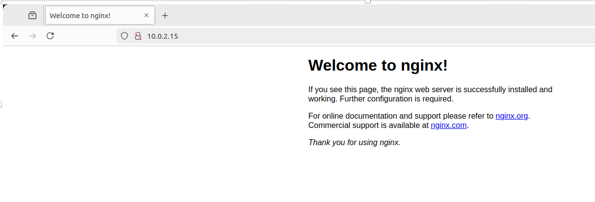


```bash
Смотрим, что порты прослушиваются
ss -tln | grep 80
``` 
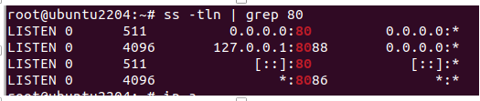


**Смотрим, что установлен rsyslog**

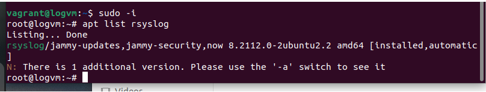

**Открываем порты** на хосте для сбора логов

```bash
nano /etc/rsyslog.conf
# снимаем комментарии с нужных строк

# provides UDP syslog reception
module(load="imudp")
input(type="imudp" port="514")

# provides TCP syslog reception
module(load="imtcp")
input(type="imtcp" port="514")
``` 

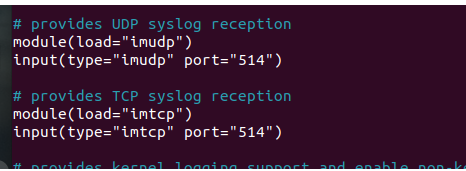


**Настраиваем правило приема сообщений от хостов**

```bash
nano /etc/rsyslog.conf
# в конец файла добавляем строки

$template RemoteLogs,"/var/log/rsyslog/%HOSTNAME%/%PROGRAMNAME%.log"
*.* ?RemoteLogs
& ~

``` 

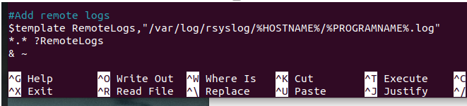


**Перезагрузим сервис и убедимся, что порты начали слушаться**

```bash
ss -tuln
``` 

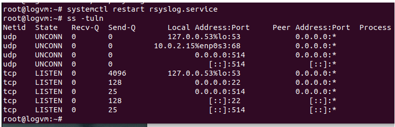


**Теперь настроим логирование на nginx**

```bash
nano /etc/nginx/nginx.conf

error_log syslog:server=192.168.56.15:514,tag=nginx_error;
access_log syslog:server=192.168.56.15:514,tag=nginx_access,severity=info combined;
``` 

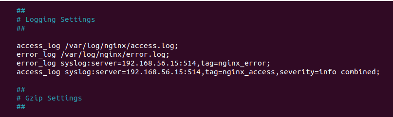


**Проверим конфигурацию**

```bash
nginx -t
``` 

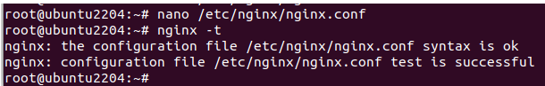


**Пару раз обновим страницу nginx в браузере**

```bash
# на сервере для сборов лога появилась новая директория
``` 

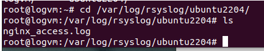


**Поломаем nginx** перенесем страницу основную в другую папку

```bash
mv /var/www/html/index.nginx-debian.html /var/www/
# видим в браузере ошибку
``` 

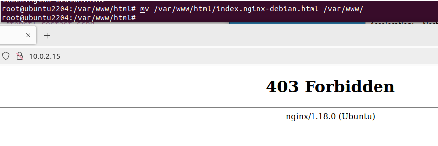


**Появилась директория с логами ошибок**

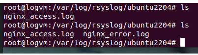
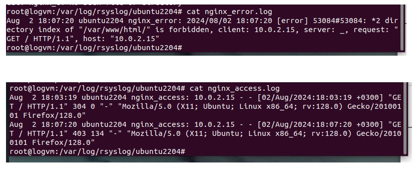


---
- Этап 2: Настройка логов на изменение конфига


**Вносим изменения в конфиг audit** (обрати внимание на путь, первый раз не в тот файл зашел)

```bash
nano /etc/audit/rules.d/audit.rules
-w /etc/nginx -p wa -k nginx_config_changes
systemctl restart auditd
``` 

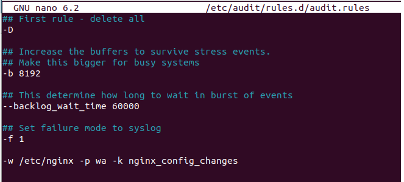


**Проверяем** вносим какие-то изменения в конфиг nginx

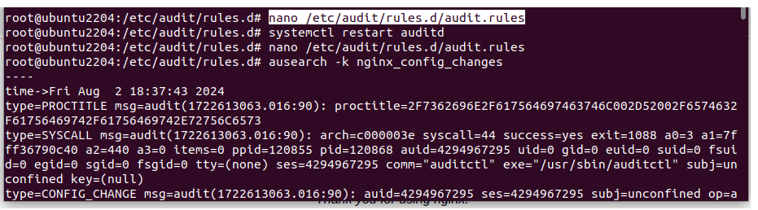
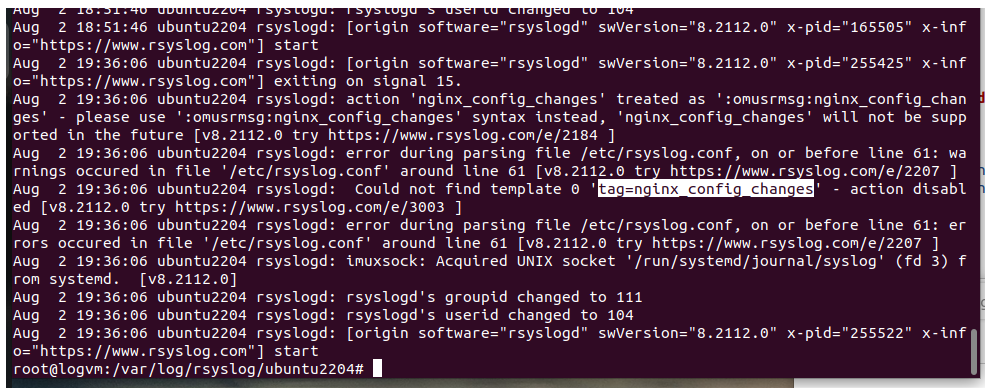

